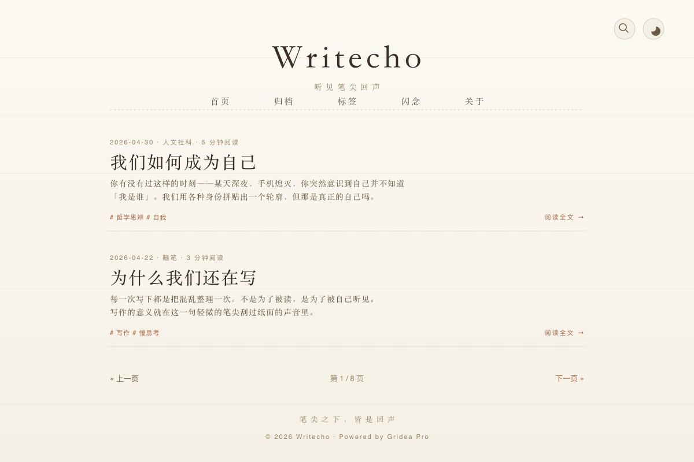

# Writecho — 听见笔尖回声

> 移植自 Typecho 主题 [Writecho](https://github.com/Skywt2003/Writecho)（原作者 SkyWT）的 Gridea Pro Jinja2 主题。
>
> **暖纸底色 · 霞鹜文楷 · 单栏 820px · 极简手写感。**

## 设计基因

- **暖纸底色 #fcf9f3**：原 Writecho 的招牌色，像翻开一本旧手账
- **820px 单栏**：纸面宽度，无侧栏，纯阅读
- **霞鹜文楷字体**：可选加载 LXGW WenKai 中文楷体，呼应「手写」气质（关闭时走系统中文栈）
- **手绘图位**：Header / Footer / 公告 / 文章「more」/ 404 都支持上传手绘图（保留原作的 100% 手写美学）
- **深浅双模**：浅色 = 手写温纸；深色 = 夜读墨色（#1d1a17 + #d8cfbe）
- **零冗余**：无侧栏、无 widget、无浮动控件（除回顶按钮）

## 视觉规格

| 项目 | 浅色 | 深色 |
|------|------|------|
| 纸面底色 | `#fcf9f3` | `#1d1a17` |
| 墨色（正文） | `#3a2e22` | `#d8cfbe` |
| 强调色 | `#a35f3a`（陶土红） | `#c4a880`（米黄棕） |
| 容器宽 | 820px | 同 |
| 字体 | LXGW WenKai / Kaiti / 系统楷体栈 | 同 |

## 包含页面

| 文件 | 用途 |
|------|------|
| `index.html` | 首页（公告图 + 文章列表 + 分页） |
| `blog.html` | 博客列表 |
| `post.html` | 文章详情（标题 + 元信息 + TOC + 正文 + 上下篇 + 评论） |
| `archives.html` | 时间轴归档（按 `archives` 全局变量分年） |
| `tags.html` | 标签云 |
| `tag.html` | 标签详情落地页 |
| `category.html` | 分类详情落地页 |
| `memos.html` | 闪念列表 + 53×7 发布热力图 |
| `links.html` | 友情链接列表 |
| `about.html` | 关于页 |
| `404.html` | 找不到页面 |

## 包含 partials

`header.html` / `footer.html` / `post-card.html` / `pagination.html` / `post-nav.html` / `comments.html` / `search-modal.html` / `heatmap.html`

## 主要 customConfig（共 30 项，9 分组）

| 组 | 关键项 |
|----|--------|
| 基础 | siteSubTitle / **headerImage** / **footerImage** / **noticeImage** / favicon |
| 外观 | themeMode / paperColor / inkColor / accentColor / containerWidth / **enableLxgw** / fontFamily |
| 首页 | indexShowNotice / indexShowFeature / indexExcerptLength |
| 闪念 | memosTitle / memosShowHeatmap |
| 增强 | showReadingProgress / showBackToTop / showCodeCopy / showToc / showSearch / viewsScript |
| 页脚 | footerSlogan / footerICP / footerShowPower / footerExtra |
| 高级 | customCSS / customHeadHtml / customBodyEndHtml |

## 与原 Writecho 的差异

| 原版（Typecho） | 本移植版（Gridea Pro Jinja2） |
|---|---|
| 100% 手绘图替代文字 | 文字 logo + 霞鹜文楷字体优先；手绘图位作为可选 customConfig |
| 无搜索 / 无分页 UI | 全屏搜索（fetch `/api/search.json`，/、Ctrl+K 唤起）+ 标准分页 |
| 无暗色模式 | 浅 / 深两套配色，四档（auto / light / dark / user）|
| 无标签 / 分类 / 归档 / 闪念 / 友链页 | 全套 11 页面 + memos 53×7 热力图 |
| Typecho 评论表单 | `#gridea-comments` 标准挂载点 |
| 评论默认注释掉 | 默认开启（可通过站点配置控制） |
| 单一 #fcf9f3 背景 | 纸面 / 墨 / 强调三色可调 |

## 安装

1. 把 `themes/writecho/` 整个目录拷到本地 Gridea Pro 站点的 `themes/` 下
2. 在客户端「主题」页面选择 Writecho
3. 在右侧自定义配置里调整 paperColor / inkColor / accentColor 等
4. 如果有手绘图素材，把图片 URL 填到 headerImage / footerImage / noticeImage

## 关于霞鹜文楷字体

- 默认 `enableLxgw = true`，走 jsDelivr CDN 加载（约 7MB，首次访问会有几秒空白）
- 字体来源：[lxgw/LxgwWenKai](https://github.com/lxgw/LxgwWenKai)（SIL OFL 1.1）
- 国内用户网络环境不佳可关闭该选项，主题会回退到 Kaiti SC / KaiTi / STKaiti / PingFang SC 系统中文栈

## License

GPL-3.0（沿用上游 Writecho 授权）。

- 原版 Writecho © 2021 SkyWT — https://github.com/Skywt2003/Writecho
- 本 Gridea Pro 移植版 © 2026 Eric

## 鸣谢

- [SkyWT](https://github.com/Skywt2003) — Writecho 原作
- [lxgw](https://github.com/lxgw) — 霞鹜文楷字体
- Gridea Pro 团队 — 桌面客户端 + Jinja2 引擎
